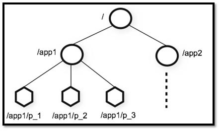
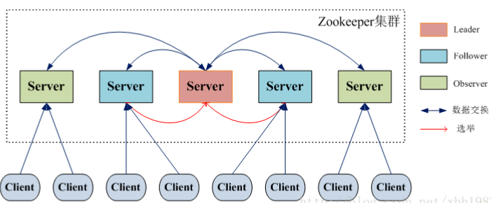

# 一.基础

## 1. 前言

## 2. ZooKeeper 介绍

### 2.1. ZooKeeper 概览

ZooKeeper 是一个开源的**分布式协调服务**，它的设计目标是将那些复杂且容易出错的分布式一致性服务封装起来，构成一个高效可靠的原语集，并以一系列简单易用的接口提供给用户使用。

> **原语：** 操作系统或计算机网络用语范畴。是由若干条指令组成的，用于完成一定功能的一个过程。具有不可分割性·即原语的执行必须是连续的，在执行过程中不允许被中断。

**ZooKeeper 为我们提供了高可用、高性能、稳定的分布式数据一致性解决方案，通常被用于实现诸如数据发布/订阅、负载均衡、命名服务、分布式协调/通知、集群管理、Master 选举、分布式锁和分布式队列等功能。**

另外，**ZooKeeper 将数据保存在内存中，性能是非常棒的。 在“读”多于“写”的应用程序中尤其地高性能，因为“写”会导致所有的服务器间同步状态。（“读”多于“写”是协调服务的典型场景）。**

### 2.3. ZooKeeper 特点

- **顺序一致性：** 从同一客户端发起的事务请求，最终将会严格地按照顺序被应用到 ZooKeeper 中去。
- **原子性：** 所有事务请求的处理结果在整个集群中所有机器上的应用情况是一致的，也就是说，要么整个集群中所有的机器都成功应用了某一个事务，要么都没有应用。
- **单一系统映像 ：** 无论客户端连到哪一个 ZooKeeper 服务器上，其看到的服务端数据模型都是一致的。
- **可靠性：** 一旦一次更改请求被应用，更改的结果就会被持久化，直到被下一次更改覆盖。

### 2.4. ZooKeeper 典型应用场景

ZooKeeper 概览中，我们介绍到使用其通常被用于实现诸如数据发布/订阅、负载均衡、命名服务、分布式协调通知、集群管理、Master 选举、分布式锁和分布式队列等功能。

下面选 3 个典型的应用场景来专门说说：

1. **分布式锁** ： 通过创建唯一节点获得分布式锁，当获得锁的一方执行完相关代码或者是挂掉之后就释放锁。
2. **命名服务** ：可以通过 ZooKeeper 的顺序节点生成全局唯一 ID
3. **数据发布/订阅** ：通过 **Watcher 机制** 可以很方便地实现数据发布/订阅。当你将数据发布到 ZooKeeper 被监听的节点上，其他机器可通过监听 ZooKeeper 上节点的变化来实现配置的动态更新。

实际上，这些功能的实现基本都得益于 ZooKeeper 可以保存数据的功能，但是 ZooKeeper 不适合保存大量数据，这一点需要注意。

### [2.5. 有哪些著名的开源项目用到了 ZooKeeper?](https://snailclimb.gitee.io/javaguide/#/docs/system-design/distributed-system/zookeeper/zookeeper-intro?id=_25-有哪些著名的开源项目用到了-zookeeper)

1. **Kafka** : ZooKeeper 主要为 Kafka 提供 Broker 和 Topic 的注册以及多个 Partition 的负载均衡等功能。
2. **Hbase** : ZooKeeper 为 Hbase 提供确保整个集群只有一个 Master 以及保存和提供 regionserver 状态信息（是否在线）等功能。
3. **Hadoop** : ZooKeeper 为 Namenode 提供高可用支持。

## 3. ZooKeeper 重要概念解读

### 3.1. Data model 数据模型

ZooKeeper 数据模型采用层次化的多叉树形结构，每个节点上都可以存储数据，这些数据可以是数字、字符串或者是二级制序列。并且。每个节点还可以拥有 N 个子节点，最上层是根节点以“/”来代表。每个数据节点在 ZooKeeper 中被称为 **znode**，它是 ZooKeeper 中数据的最小单元。并且，每个 znode 都一个唯一的路径标识。

强调一句：**ZooKeeper 主要是用来协调服务的，而不是用来存储业务数据的，所以不要放比较大的数据在 znode 上，ZooKeeper 给出的上限是每个结点的数据大小最大是 1M。**

从下图可以更直观地看出：ZooKeeper 节点路径标识方式和 Unix 文件系统路径非常相似，都是由一系列使用斜杠"/"进行分割的路径表示，开发人员可以向这个节点中写人数据，也可以在节点下面创建子节点。这些操作我们后面都会介绍到。



### 3.2. znode（数据节点）

介绍了 ZooKeeper 树形数据模型之后，我们知道每个数据节点在 ZooKeeper 中被称为 **znode**，它是 ZooKeeper 中数据的最小单元。你要存放的数据就放在上面，是你使用 ZooKeeper 过程中经常需要接触到的一个概念。

#### [3.2.1. znode 4种类型](https://snailclimb.gitee.io/javaguide/#/docs/system-design/distributed-system/zookeeper/zookeeper-intro?id=_321-znode-4种类型)

我们通常是将 znode 分为 4 大类：

- **持久（PERSISTENT）节点** ：一旦创建就一直存在即使 ZooKeeper 集群宕机，直到将其删除。
- **临时（EPHEMERAL）节点** ：临时节点的生命周期是与 **客户端会话（session）** 绑定的，**会话消失则节点消失** 。并且，**临时节点只能做叶子节点** ，不能创建子节点。
- **持久顺序（PERSISTENT_SEQUENTIAL）节点** ：除了具有持久（PERSISTENT）节点的特性之外， 子节点的名称还具有顺序性。比如 `/node1/app0000000001` 、`/node1/app0000000002` 。
- **临时顺序（EPHEMERAL_SEQUENTIAL）节点** ：除了具备临时（EPHEMERAL）节点的特性之外，子节点的名称还具有顺序性。

#### 3.2.2. znode 数据结构

每个 znode 由 2 部分组成:

- **stat** ：状态信息
- **data** ： 节点存放的数据的具体内容

如下所示，我通过 get 命令来获取 根目录下的 dubbo 节点的内容。（get 命令在下面会介绍到）。

```shell
[zk: 127.0.0.1:2181(CONNECTED) 6] get /dubbo
# 该数据节点关联的数据内容为空
null
# 下面是该数据节点的一些状态信息，其实就是 Stat 对象的格式化输出
cZxid = 0x2
ctime = Tue Nov 27 11:05:34 CST 2018
mZxid = 0x2
mtime = Tue Nov 27 11:05:34 CST 2018
pZxid = 0x3
cversion = 1
dataVersion = 0
aclVersion = 0
ephemeralOwner = 0x0
dataLength = 0
numChildren = 1Copy to clipboardErrorCopied
```

Stat 类中包含了一个数据节点的所有状态信息的字段，包括事务 ID-cZxid、节点创建时间-ctime 和子节点个数-numChildren 等等。

| znode 状态信息 | 解释                                                         |
| -------------- | ------------------------------------------------------------ |
| cZxid          | create ZXID，即该数据节点被创建时的事务 id                   |
| ctime          | create time，即该节点的创建时间                              |
| mZxid          | modified ZXID，即该节点最终一次更新时的事务 id               |
| mtime          | modified time，即该节点最后一次的更新时间                    |
| pZxid          | 该节点的子节点列表最后一次修改时的事务 id，只有子节点列表变更才会更新 pZxid，子节点内容变更不会更新 |
| cversion       | 子节点版本号，当前节点的子节点每次变化时值增加 1             |
| dataVersion    | 数据节点内容版本号，节点创建时为 0，每更新一次节点内容(不管内容有无变化)该版本号的值增加 1 |
| aclVersion     | 节点的 ACL 版本号，表示该节点 ACL 信息变更次数               |
| ephemeralOwner | 创建该临时节点的会话的 sessionId；如果当前节点为持久节点，则 ephemeralOwner=0 |
| dataLength     | 数据节点内容长度                                             |
| numChildren    | 当前节点的子节点个数                                         |

### 3.3. 版本（version）

在前面我们已经提到，对应于每个 znode，ZooKeeper 都会为其维护一个叫作 **Stat** 的数据结构，Stat 中记录了这个 znode 的三个相关的版本：

- **dataVersion** ：当前 znode 节点的版本号
- **cversion** ： 当前 znode 子节点的版本
- **aclVersion** ： 当前 znode 的 ACL 的版本。

### [3.4. ACL（权限控制）](https://snailclimb.gitee.io/javaguide/#/docs/system-design/distributed-system/zookeeper/zookeeper-intro?id=_34-acl（权限控制）)

ZooKeeper 采用 ACL（AccessControlLists）策略来进行权限控制，类似于 UNIX 文件系统的权限控制。

对于 znode 操作的权限，ZooKeeper 提供了以下 5 种：

- **CREATE** : 能创建子节点
- **READ** ：能获取节点数据和列出其子节点
- **WRITE** : 能设置/更新节点数据
- **DELETE** : 能删除子节点
- **ADMIN** : 能设置节点 ACL 的权限

其中尤其需要注意的是，**CREATE** 和 **DELETE** 这两种权限都是针对 **子节点** 的权限控制。

对于身份认证，提供了以下几种方式：

- **world** ： 默认方式，所有用户都可无条件访问。
- **auth** :不使用任何 id，代表任何已认证的用户。
- **digest** :用户名:密码认证方式： *username:password* 。
- **ip** : 对指定 ip 进行限制。

### [3.5. Watcher（事件监听器）](https://snailclimb.gitee.io/javaguide/#/docs/system-design/distributed-system/zookeeper/zookeeper-intro?id=_35-watcher（事件监听器）)

Watcher（事件监听器），是 ZooKeeper 中的一个很重要的特性。ZooKeeper 允许用户在指定节点上注册一些 Watcher，并且在一些特定事件触发的时候，ZooKeeper 服务端会将事件通知到感兴趣的客户端上去，该机制是 ZooKeeper 实现分布式协调服务的重要特性。


### [3.6. 会话（Session）

Session 可以看作是 ZooKeeper 服务器与客户端的之间的一个 TCP 长连接，通过这个连接，客户端能够通过心跳检测与服务器保持有效的会话，也能够向 ZooKeeper 服务器发送请求并接受响应，同时还能够通过该连接接收来自服务器的 Watcher 事件通知。

Session 有一个属性叫做：`sessionTimeout` ，`sessionTimeout` 代表会话的超时时间。当由于服务器压力太大、网络故障或是客户端主动断开连接等各种原因导致客户端连接断开时，只要在`sessionTimeout`规定的时间内能够重新连接上集群中任意一台服务器，那么之前创建的会话仍然有效。

另外，在为客户端创建会话之前，服务端首先会为每个客户端都分配一个 `sessionID`。由于 `sessionID`是 ZooKeeper 会话的一个重要标识，许多与会话相关的运行机制都是基于这个 `sessionID` 的，因此，无论是哪台服务器为客户端分配的 `sessionID`，都务必保证**全局唯一**。

## [4. ZooKeeper 集群

为了保证高可用，最好是以集群形态来部署 ZooKeeper，这样只要集群中大部分机器是可用的（能够容忍一定的机器故障），那么 ZooKeeper 本身仍然是可用的。通常 3 台服务器就可以构成一个 ZooKeeper 集群了。ZooKeeper 官方提供的架构图就是一个 ZooKeeper 集群整体对外提供服务。


上图中每一个 Server 代表一个安装 ZooKeeper 服务的服务器。组成 ZooKeeper 服务的服务器都会在内存中维护当前的服务器状态，并且每台服务器之间都互相保持着通信。集群间通过 ZAB 协议（ZooKeeper Atomic Broadcast）来保持数据的一致性。

**最典型集群模式： Master/Slave 模式（主备模式）**。在这种模式中，通常 Master 服务器作为**主服务器提供写服务**，其他的 Slave 服务器从服务器通过**异步复制**的方式获取 Master 服务器最新的数据提供读服务。

### [4.1. ZooKeeper 集群角色

但是，在 ZooKeeper 中没有选择传统的 Master/Slave 概念，而是引入了 Leader、Follower 和 Observer 三种角色。如下图所示



ZooKeeper 集群中的所有机器通过一个 **Leader 选举过程** 来选定一台称为 “**Leader**” 的机器，Leader 既可以为客户端提供写服务又能提供读服务。除了 Leader 外，**Follower** 和 **Observer** 都只能提供读服务。Follower 和 Observer 唯一的区别在于 **Observer 机器不参与 Leader 的选举过程**，**也不参与写操作的“过半写成功”策略，因此 Observer 机器可以在不影响写性能的情况下提升集群的读性能。**

| 角色     | 说明                                                         |
| -------- | ------------------------------------------------------------ |
| Leader   | 为客户端提供读和写的服务，负责投票的发起和决议，更新系统状态。 |
| Follower | 为客户端提供读服务，如果是写服务则转发给 Leader。在选举过程中参与投票。 |
| Observer | 为客户端提供读服务器，如果是写服务则转发给 Leader。不参与选举过程中的投票，也不参与“过半写成功”策略。在不影响写性能的情况下提升集群的读性能。此角色于 **ZooKeeper3.3** 系列新增的角色。 |

当 Leader 服务器出现网络中断、崩溃退出与重启等异常情况时，就会进入 Leader 选举过程，这个过程会选举产生新的 Leader 服务器。

这个过程大致是这样的：

1. **Leader election（选举阶段）**：节点在一开始都处于选举阶段，只要有一个节点得到超半数节点的票数，它就可以当选准 leader。
2. **Discovery（发现阶段）** ：在这个阶段，followers 跟准 leader 进行通信，同步 followers 最近接收的事务提议。
3. **Synchronization（同步阶段）** :同步阶段主要是利用 leader 前一阶段获得的最新提议历史，同步集群中所有的副本。同步完成之后 准 leader 才会成为真正的 leader。
4. **Broadcast（广播阶段）** :到了这个阶段，ZooKeeper 集群才能正式对外提供事务服务，并且 leader 可以进行消息广播。同时如果有新的节点加入，还需要对新节点进行同步。

### [4.2. ZooKeeper 集群中的服务器状态


- **LOOKING** ：寻找 Leader。
- **LEADING** ：Leader 状态，对应的节点为 Leader。
- **FOLLOWING** ：Follower 状态，对应的节点为 Follower。
- **OBSERVING** ：Observer 状态，对应节点为 Observer，该节点不参与 Leader 选举。

### [4.3. ZooKeeper 集群为啥最好奇数台？


ZooKeeper 集群在宕掉几个 ZooKeeper 服务器之后，如果剩下的 ZooKeeper 服务器个数大于宕掉的个数的话整个 ZooKeeper 才依然可用。假如我们的集群中有 n 台 ZooKeeper 服务器，那么也就是剩下的服务数必须大于 n/2。先说一下结论，2n 和 2n-1 的容忍度是一样的，都是 n-1，大家可以先自己仔细想一想，这应该是一个很简单的数学问题了。 比如假如我们有 3 台，那么最大允许宕掉 1 台 ZooKeeper 服务器，如果我们有 4 台的的时候也同样只允许宕掉 1 台。 假如我们有 5 台，那么最大允许宕掉 2 台 ZooKeeper 服务器，如果我们有 6 台的的时候也同样只允许宕掉 2 台。

综上，何必增加那一个不必要的 ZooKeeper 呢？

## [5. ZAB 协议和Paxos 算法


Paxos 算法应该可以说是 ZooKeeper 的灵魂了。但是，ZooKeeper 并没有完全采用 Paxos算法 ，而是使用 ZAB 协议作为其保证数据一致性的核心算法。另外，在ZooKeeper的官方文档中也指出，ZAB协议并不像 Paxos 算法那样，是一种通用的分布式一致性算法，它是一种特别为Zookeeper设计的崩溃可恢复的原子消息广播算法。

### [5.1. ZAB 协议介绍](https://snailclimb.gitee.io/javaguide/#/docs/system-design/distributed-system/zookeeper/zookeeper-intro?id=_51-zab-协议介绍)

ZAB（ZooKeeper Atomic Broadcast 原子广播） 协议是为分布式协调服务 ZooKeeper 专门设计的一种支持崩溃恢复的原子广播协议。 在 ZooKeeper 中，主要依赖 ZAB 协议来实现分布式数据一致性，基于该协议，ZooKeeper 实现了一种主备模式的系统架构来保持集群中各个副本之间的数据一致性。

### [5.2. ZAB 协议两种基本的模式：崩溃恢复和消息广播 

ZAB 协议包括两种基本的模式，分别是

- **崩溃恢复** ：当整个服务框架在启动过程中，或是当 Leader 服务器出现网络中断、崩溃退出与重启等异常情况时，ZAB 协议就会进入恢复模式并选举产生新的Leader服务器。当选举产生了新的 Leader 服务器，同时集群中已经有过半的机器与该Leader服务器完成了状态同步之后，ZAB协议就会退出恢复模式。其中，**所谓的状态同步是指数据同步，用来保证集群中存在过半的机器能够和Leader服务器的数据状态保持一致**。
- **消息广播** ：**当集群中已经有过半的Follower服务器完成了和Leader服务器的状态同步，那么整个服务框架就可以进入消息广播模式了。** 当一台同样遵守ZAB协议的服务器启动后加入到集群中时，如果此时集群中已经存在一个Leader服务器在负责进行消息广播，那么新加入的服务器就会自觉地进入数据恢复模式：找到Leader所在的服务器，并与其进行数据同步，然后一起参与到消息广播流程中去。

关于 **ZAB 协议&Paxos算法** 需要讲和理解的东西太多了，具体可以看下面这两篇文章：

- [图解 Paxos 一致性协议](http://codemacro.com/2014/10/15/explain-poxos/)
- [Zookeeper ZAB 协议分析](https://dbaplus.cn/news-141-1875-1.html)

### 5.3 什么是Zab协议？

Zab协议 的全称是 **Zookeeper Atomic Broadcast** （Zookeeper原子广播）。
 **Zookeeper 是通过 Zab 协议来保证分布式事务的最终一致性**。

1. Zab协议是为分布式协调服务Zookeeper专门设计的一种 **支持崩溃恢复** 的 **原子广播协议** ，是Zookeeper保证数据一致性的核心算法。Zab借鉴了Paxos算法，但又不像Paxos那样，是一种通用的分布式一致性算法。**它是特别为Zookeeper设计的支持崩溃恢复的原子广播协议**。
2. 在Zookeeper中主要依赖Zab协议来实现数据一致性，基于该协议，zk实现了一种主备模型（即Leader和Follower模型）的系统架构来保证集群中各个副本之间数据的一致性。
    这里的主备系统架构模型，就是指只有一台客户端（Leader）负责处理外部的写事务请求，然后Leader客户端将数据同步到其他Follower节点。

Zookeeper 客户端会随机的链接到 zookeeper 集群中的一个节点，如果是读请求，就直接从当前节点中读取数据；如果是写请求，那么节点就会向 Leader 提交事务，Leader 接收到事务提交，会广播该事务，只要超过半数节点写入成功，该事务就会被提交。

**Zab 协议的特性**：
 1）Zab 协议需要确保那些**已经在 Leader 服务器上提交（Commit）的事务最终被所有的服务器提交**。
 2）Zab 协议需要确保**丢弃那些只在 Leader 上被提出而没有被提交的事务**。

## Zab 协议实现的作用

1）**使用一个单一的主进程（Leader）来接收并处理客户端的事务请求**（也就是写请求），并采用了Zab的原子广播协议，将服务器数据的状态变更以 **事务proposal** （事务提议）的形式广播到所有的副本（Follower）进程上去。
 

2）**保证一个全局的变更序列被顺序引用**。
 Zookeeper是一个树形结构，很多操作都要先检查才能确定是否可以执行，比如P1的事务t1可能是创建节点"/a"，t2可能是创建节点"/a/bb"，只有先创建了父节点"/a"，才能创建子节点"/a/b"。

为了保证这一点，Zab要保证同一个Leader发起的事务要按顺序被apply，同时还要保证只有先前Leader的事务被apply之后，新选举出来的Leader才能再次发起事务。
 

3）**当主进程出现异常的时候，整个zk集群依旧能正常工作**。

------


## Zab协议原理

Zab协议要求每个 Leader 都要经历三个阶段：**发现，同步，广播**。

- **发现**：要求zookeeper集群必须选举出一个 Leader 进程，同时 Leader 会维护一个 Follower 可用客户端列表。将来客户端可以和这些 Follower节点进行通信。
- **同步**：Leader 要负责将本身的数据与 Follower 完成同步，做到多副本存储。这样也是提现了CAP中的高可用和分区容错。Follower将队列中未处理完的请求消费完成后，写入本地事务日志中。
- **广播**：Leader 可以接受客户端新的事务Proposal请求，将新的Proposal请求广播给所有的 Follower。

------


## Zab协议核心

Zab协议的核心：**定义了事务请求的处理方式**

1）所有的事务请求必须由一个全局唯一的服务器来协调处理，这样的服务器被叫做 **Leader服务器**。其他剩余的服务器则是 **Follower服务器**。

2）Leader服务器 负责将一个客户端事务请求，转换成一个 **事务Proposal**，并将该 Proposal 分发给集群中所有的 Follower 服务器，也就是向所有 Follower 节点发送数据广播请求（或数据复制）

3）分发之后Leader服务器需要等待所有Follower服务器的反馈（Ack请求），**在Zab协议中，只要超过半数的Follower服务器进行了正确的反馈**后（也就是收到半数以上的Follower的Ack请求），那么 Leader 就会再次向所有的 Follower服务器发送 Commit 消息，要求其将上一个 事务proposal 进行提交。


事务请求处理

------


## Zab协议内容

Zab 协议包括两种基本的模式：**崩溃恢复** 和 **消息广播**

#### 协议过程

当整个集群启动过程中，或者当 Leader 服务器出现网络中弄断、崩溃退出或重启等异常时，Zab协议就会 **进入崩溃恢复模式**，选举产生新的Leader。

当选举产生了新的 Leader，同时集群中有过半的机器与该 Leader 服务器完成了状态同步（即数据同步）之后，Zab协议就会退出崩溃恢复模式，**进入消息广播模式**。

这时，如果有一台遵守Zab协议的服务器加入集群，因为此时集群中已经存在一个Leader服务器在广播消息，那么该新加入的服务器自动进入恢复模式：找到Leader服务器，并且完成数据同步。同步完成后，作为新的Follower一起参与到消息广播流程中。
 

#### 协议状态切换

当Leader出现崩溃退出或者机器重启，亦或是集群中不存在超过半数的服务器与Leader保存正常通信，Zab就会再一次进入崩溃恢复，发起新一轮Leader选举并实现数据同步。同步完成后又会进入消息广播模式，接收事务请求。
 

#### 保证消息有序

在整个消息广播中，Leader会将每一个事务请求转换成对应的 proposal 来进行广播，并且在广播 事务Proposal 之前，Leader服务器会首先为这个事务Proposal分配一个全局单递增的唯一ID，称之为事务ID（即zxid），由于Zab协议需要保证每一个消息的严格的顺序关系，因此必须将每一个proposal按照其zxid的先后顺序进行排序和处理。

------


## 消息广播

1）在zookeeper集群中，数据副本的传递策略就是采用消息广播模式。zookeeper中农数据副本的同步方式与二段提交相似，但是却又不同。二段提交要求协调者必须等到所有的参与者全部反馈ACK确认消息后，再发送commit消息。要求所有的参与者要么全部成功，要么全部失败。二段提交会产生严重的阻塞问题。

2）Zab协议中 Leader 等待 Follower 的ACK反馈消息是指“只要半数以上的Follower成功反馈即可，不需要收到全部Follower反馈”


消息广播流程图


#### 消息广播具体步骤

1）客户端发起一个写操作请求。

2）Leader 服务器将客户端的请求转化为事务 Proposal 提案，同时为每个 Proposal 分配一个全局的ID，即zxid。

3）Leader 服务器为每个 Follower 服务器分配一个单独的队列，然后将需要广播的 Proposal 依次放到队列中取，并且根据 FIFO 策略进行消息发送。

4）Follower 接收到 Proposal 后，会首先将其以事务日志的方式写入本地磁盘中，写入成功后向 Leader 反馈一个 Ack 响应消息。

5）Leader 接收到超过半数以上 Follower 的 Ack 响应消息后，即认为消息发送成功，可以发送 commit 消息。

6）Leader 向所有 Follower 广播 commit 消息，同时自身也会完成事务提交。Follower 接收到 commit 消息后，会将上一条事务提交。

**zookeeper 采用 Zab 协议的核心，就是只要有一台服务器提交了 Proposal，就要确保所有的服务器最终都能正确提交 Proposal。这也是 CAP/BASE 实现最终一致性的一个体现。**

**Leader 服务器与每一个 Follower 服务器之间都维护了一个单独的 FIFO 消息队列进行收发消息，使用队列消息可以做到异步解耦。 Leader 和 Follower 之间只需要往队列中发消息即可。如果使用同步的方式会引起阻塞，性能要下降很多。**

------


## 崩溃恢复

**一旦 Leader 服务器出现崩溃或者由于网络原因导致 Leader 服务器失去了与过半 Follower 的联系，那么就会进入崩溃恢复模式。**

在 Zab 协议中，为了保证程序的正确运行，整个恢复过程结束后需要选举出一个新的 Leader 服务器。因此 Zab 协议需要一个高效且可靠的 Leader 选举算法，从而确保能够快速选举出新的 Leader 。

Leader 选举算法不仅仅需要让 Leader 自己知道自己已经被选举为 Leader ，同时还需要让集群中的所有其他机器也能够快速感知到选举产生的新 Leader 服务器。

崩溃恢复主要包括两部分：**Leader选举** 和 **数据恢复**


#### Zab 协议如何保证数据一致性

假设两种异常情况：
 1、一个事务在 Leader 上提交了，并且过半的 Folower 都响应 Ack 了，但是 Leader 在 Commit 消息发出之前挂了。
 2、假设一个事务在 Leader 提出之后，Leader 挂了。

要确保如果发生上述两种情况，数据还能保持一致性，那么 Zab 协议选举算法必须满足以下要求：

**Zab 协议崩溃恢复要求满足以下两个要求**：
 1）**确保已经被 Leader 提交的 Proposal 必须最终被所有的 Follower 服务器提交**。
 2）**确保丢弃已经被 Leader 提出的但是没有被提交的 Proposal**。

根据上述要求
 Zab协议需要保证选举出来的Leader需要满足以下条件：
 1）**新选举出来的 Leader 不能包含未提交的 Proposal** 。
 即新选举的 Leader 必须都是已经提交了 Proposal 的 Follower 服务器节点。
 2）**新选举的 Leader 节点中含有最大的 zxid** 。
 这样做的好处是可以避免 Leader 服务器检查 Proposal 的提交和丢弃工作。

#### Zab 如何数据同步

1）完成 Leader 选举后（新的 Leader 具有最高的zxid），在正式开始工作之前（接收事务请求，然后提出新的 Proposal），Leader 服务器会首先确认事务日志中的所有的 Proposal 是否已经被集群中过半的服务器 Commit。

2）Leader 服务器需要确保所有的 Follower 服务器能够接收到每一条事务的 Proposal ，并且能将所有已经提交的事务 Proposal 应用到内存数据中。等到 Follower 将所有尚未同步的事务 Proposal 都从 Leader 服务器上同步过啦并且应用到内存数据中以后，Leader 才会把该 Follower 加入到真正可用的 Follower 列表中。
 

#### Zab 数据同步过程中，如何处理需要丢弃的 Proposal

在 Zab 的事务编号 zxid 设计中，zxid是一个64位的数字。

其中低32位可以看成一个简单的单增计数器，针对客户端每一个事务请求，Leader 在产生新的 Proposal 事务时，都会对该计数器加1。而高32位则代表了 Leader 周期的 epoch 编号。

> epoch 编号可以理解为当前集群所处的年代，或者周期。每次Leader变更之后都会在 epoch 的基础上加1，这样旧的 Leader 崩溃恢复之后，其他Follower 也不会听它的了，因为 Follower 只服从epoch最高的 Leader 命令。

每当选举产生一个新的 Leader ，就会从这个 Leader 服务器上取出本地事务日志充最大编号 Proposal 的 zxid，并从 zxid 中解析得到对应的 epoch 编号，然后再对其加1，之后该编号就作为新的 epoch 值，并将低32位数字归零，由0开始重新生成zxid。

**Zab 协议通过 epoch 编号来区分 Leader 变化周期**，能够有效避免不同的 Leader 错误的使用了相同的 zxid 编号提出了不一样的 Proposal 的异常情况。

基于以上策略
 **当一个包含了上一个 Leader 周期中尚未提交过的事务 Proposal 的服务器启动时，当这台机器加入集群中，以 Follower 角色连上 Leader 服务器后，Leader 服务器会根据自己服务器上最后提交的 Proposal 来和 Follower 服务器的 Proposal 进行比对，比对的结果肯定是 Leader 要求 Follower 进行一个回退操作，回退到一个确实已经被集群中过半机器 Commit 的最新 Proposal**。

------


## 实现原理

**Zab 节点有三种状态**：

- Following：当前节点是跟随者，服从 Leader 节点的命令。
- Leading：当前节点是 Leader，负责协调事务。
- Election/Looking：节点处于选举状态，正在寻找 Leader。

代码实现中，多了一种状态：Observing 状态
 这是 Zookeeper 引入 Observer 之后加入的，Observer 不参与选举，是只读节点，跟 Zab 协议没有关系。

**节点的持久状态**：

- history：当前节点接收到事务 Proposal 的Log
- acceptedEpoch：Follower 已经接受的 Leader 更改 epoch 的 newEpoch 提议。
- currentEpoch：当前所处的 Leader 年代
- lastZxid：history 中最近接收到的Proposal 的 zxid（最大zxid）
   

#### Zab 的四个阶段

**1、选举阶段（Leader Election）**
 节点在一开始都处于选举节点，只要有一个节点得到超过半数节点的票数，它就可以当选准 Leader，只有到达第三个阶段（也就是同步阶段），这个准 Leader 才会成为真正的 Leader。

**Zookeeper 规定所有有效的投票都必须在同一个 轮次 中，每个服务器在开始新一轮投票时，都会对自己维护的 logicalClock 进行自增操作**。

每个服务器在广播自己的选票前，会将自己的投票箱（recvset）清空。该投票箱记录了所受到的选票。
 例如：Server_2 投票给 Server_3，Server_3 投票给 Server_1，则Server_1的投票箱为(2,3)、(3,1)、(1,1)。（每个服务器都会默认给自己投票）

前一个数字表示投票者，后一个数字表示被选举者。票箱中只会记录每一个投票者的最后一次投票记录，如果投票者更新自己的选票，则其他服务器收到该新选票后会在自己的票箱中更新该服务器的选票。

**这一阶段的目的就是为了选出一个准 Leader ，然后进入下一个阶段。**
 协议并没有规定详细的选举算法，后面会提到实现中使用的 Fast Leader Election。


选举流程


**2、发现阶段（Descovery）**
 在这个阶段，Followers 和上一轮选举出的准 Leader 进行通信，同步 Followers 最近接收的事务 Proposal 。
 一个 Follower 只会连接一个 Leader，如果一个 Follower 节点认为另一个 Follower 节点，则会在尝试连接时被拒绝。被拒绝之后，该节点就会进入 Leader Election阶段。

**这个阶段的主要目的是发现当前大多数节点接收的最新 Proposal，并且准 Leader 生成新的 epoch ，让 Followers 接收，更新它们的 acceptedEpoch**。


发现流程


**3、同步阶段（Synchronization）**
 **同步阶段主要是利用 Leader 前一阶段获得的最新 Proposal 历史，同步集群中所有的副本**。
 只有当 quorum（超过半数的节点） 都同步完成，准 Leader 才会成为真正的 Leader。Follower 只会接收 zxid 比自己 lastZxid 大的 Proposal。


同步流程


**4、广播阶段（Broadcast）**
 到了这个阶段，Zookeeper 集群才能正式对外提供事务服务，并且 Leader 可以进行消息广播。同时，如果有新的节点加入，还需要对新节点进行同步。
 需要注意的是，Zab 提交事务并不像 2PC 一样需要全部 Follower 都 Ack，只需要得到 quorum（超过半数的节点）的Ack 就可以。


广播流程


------


## 协议实现

协议的 Java 版本实现跟上面的定义略有不同，选举阶段使用的是 Fast Leader Election（FLE），它包含了步骤1的发现指责。因为FLE会选举拥有最新提议的历史节点作为 Leader，这样就省去了发现最新提议的步骤。

实际的实现将发现和同步阶段合并为 Recovery Phase（恢复阶段），所以，Zab 的实现实际上有三个阶段。

#### Zab协议三个阶段：

1）**选举（Fast Leader Election）**
 2）**恢复（Recovery Phase）**
 3）**广播（Broadcast Phase）**

**Fast Leader Election（快速选举）**
 前面提到的 FLE 会选举拥有最新Proposal history （lastZxid最大）的节点作为 Leader，这样就省去了发现最新提议的步骤。**这是基于拥有最新提议的节点也拥有最新的提交记录**

- **成为 Leader 的条件：**
   1）选 epoch 最大的
   2）若 epoch 相等，选 zxid 最大的
   3）若 epoch 和 zxid 相等，选择 server_id 最大的（zoo.cfg中的myid）

节点在选举开始时，都默认投票给自己，当接收其他节点的选票时，会根据上面的 **Leader条件** 判断并且更改自己的选票，然后重新发送选票给其他节点。**当有一个节点的得票超过半数，该节点会设置自己的状态为 Leading ，其他节点会设置自己的状态为 Following**。


选举过程


**Recovery Phase（恢复阶段）**
 这一阶段 Follower 发送他们的 lastZxid 给 Leader，Leader 根据 lastZxid 决定如何同步数据。这里的实现跟前面的 Phase 2 有所不同：Follower 收到 TRUNC 指令会终止 L.lastCommitedZxid 之后的 Proposal ，收到 DIFF 指令会接收新的 Proposal。

> history.lastCommitedZxid：最近被提交的 Proposal zxid
>  history.oldThreshold：被认为已经太旧的已经提交的 Proposal zxid
>
> 
>
> 恢复阶段


------


 （如果有什么错误或者建议，欢迎留言指出）
 （本文内容是对各个知识点的转载整理，用于个人技术沉淀，以及大家学习交流用）

------

参考资料：
 [Zookeeper中的ZAB协议理解](https://links.jianshu.com/go?to=https%3A%2F%2Fblog.csdn.net%2Fjunchenbb0430%2Farticle%2Fdetails%2F77583955)
 [简书-Zookeeper之Zab协议](https://www.jianshu.com/p/d8b8baae0f30)
 [简书-Zookeeper Zab协议](https://www.jianshu.com/p/3fec1f8bfc5f)
 [一致性理论——一致性协议之zab协议](https://links.jianshu.com/go?to=http%3A%2F%2Fthinkinjava.cn%2F2018%2F03%2F%E5%88%86%E5%B8%83%E5%BC%8F%E7%90%86%E8%AE%BA(%E4%B8%83)-%E4%B8%80%E8%87%B4%E6%80%A7%E5%8D%8F%E8%AE%AE%E4%B9%8B-ZAB%2F)
 [Zookeeper系列（5）--ZAB协议，消息广播，崩溃恢复，数据同步](https://links.jianshu.com/go?to=https%3A%2F%2Fblog.csdn.net%2Fu013679744%2Farticle%2Fdetails%2F79240249)

[《实例详解Zk的 Zab 协议分布式锁与领导选举》](https://links.jianshu.com/go?to=https%3A%2F%2Fmp.weixin.qq.com%2Fs%3F__biz%3DMzI4NTA1MDEwNg%3D%3D%26mid%3D2650764806%26idx%3D1%26sn%3D48d6d8a99bbaee3dcac2e12e3bf04ea7%26chksm%3Df3f9c393c48e4a85dd5e4b2f741934ec3919c7fc4d4b7cfc26422f6f0977fbcafb8b30dcec5a%26mpshare%3D1%26scene%3D24%26srcid%3D0105FEZLQd1wIshoJGfSDSX4%26key%3De58c60872eb97b11b762dca1ca1a39524e285b7e7e284fa90d835cc587cd24be77863773de3eb26f4f361ce6d2cc7102954c85abb312df1ae20260f353cfbffe6df7e7547f7d769809a9156ad4122cb5%26ascene%3D0%26uin%3DNzc5NTUyMTQw%26devicetype%3DiMac14%252C1%2BOSX%2BOSX%2B10.12.5%2Bbuild(16F73)%26version%3D12020610%26nettype%3DWIFI%26lang%3Dzh_CN%26fontScale%3D100%26pass_ticket%3DS3JxgA9EegL3%252FLyZHJR7A4UUD6efECHmVViRoiiCAEvrQ%252FsOgKfJU7SiM8TTfYn3)
 [Zab协议介绍](https://links.jianshu.com/go?to=https%3A%2F%2Fwww.cnblogs.com%2Fjian-xiao%2Fp%2F5821675.html)


作者：_Zy
链接：https://www.jianshu.com/p/2bceacd60b8a
来源：简书
著作权归作者所有。商业转载请联系作者获得授权，非商业转载请注明出处。


## [6. 总结](https://snailclimb.gitee.io/javaguide/#/docs/system-design/distributed-system/zookeeper/zookeeper-intro?id=_6-总结)

1. ZooKeeper 本身就是一个分布式程序（只要半数以上节点存活，ZooKeeper 就能正常服务）。
2. 为了保证高可用，最好是以集群形态来部署 ZooKeeper，这样只要集群中大部分机器是可用的（能够容忍一定的机器故障），那么 ZooKeeper 本身仍然是可用的。
3. ZooKeeper 将数据保存在内存中，这也就保证了 高吞吐量和低延迟（但是内存限制了能够存储的容量不太大，此限制也是保持 znode 中存储的数据量较小的进一步原因）。
4. ZooKeeper 是高性能的。 在“读”多于“写”的应用程序中尤其地明显，因为“写”会导致所有的服务器间同步状态。（“读”多于“写”是协调服务的典型场景。）
5. ZooKeeper 有临时节点的概念。 当创建临时节点的客户端会话一直保持活动，瞬时节点就一直存在。而当会话终结时，瞬时节点被删除。持久节点是指一旦这个 znode 被创建了，除非主动进行 znode 的移除操作，否则这个 znode 将一直保存在 ZooKeeper 上。
6. ZooKeeper 底层其实只提供了两个功能：① 管理（存储、读取）用户程序提交的数据；② 为用户程序提供数据节点监听服务。